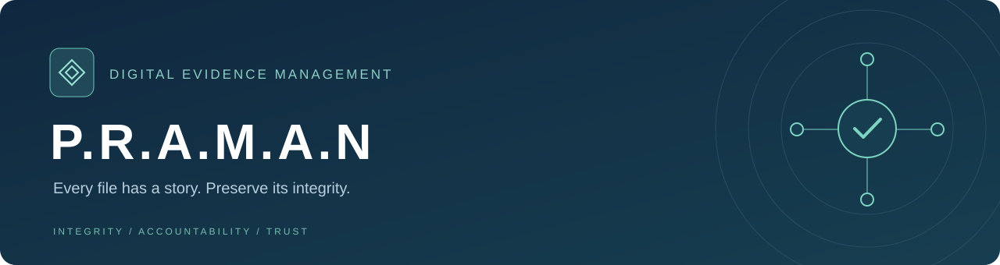
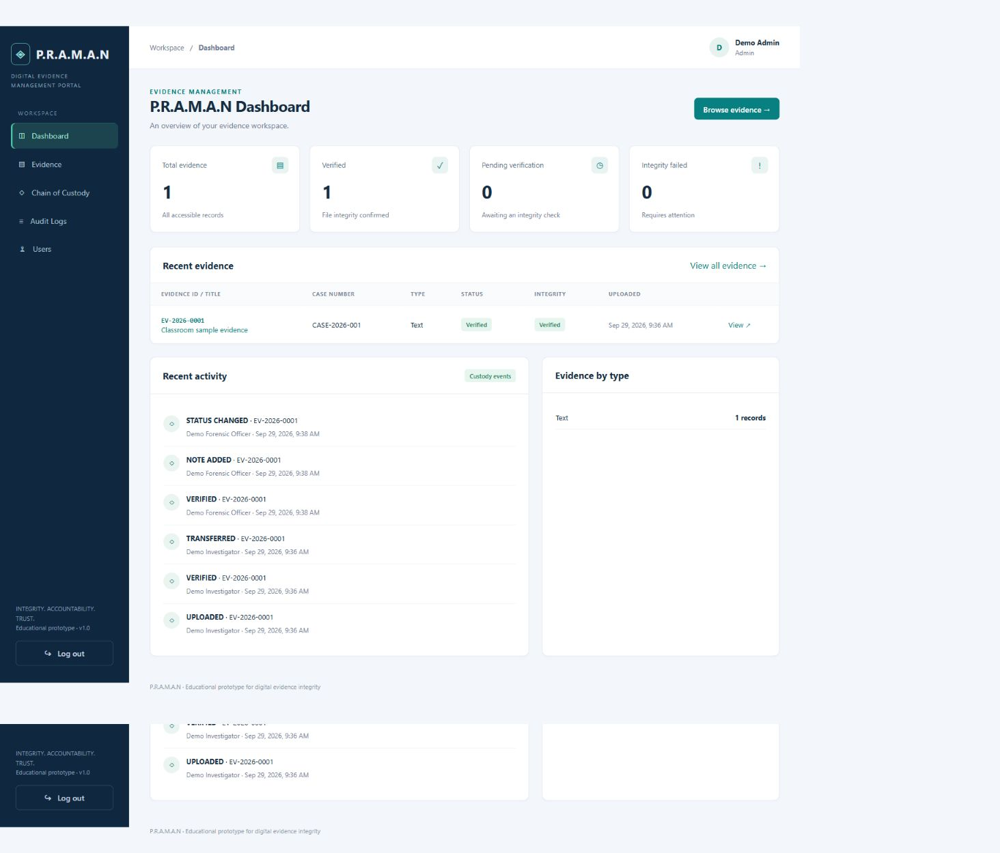
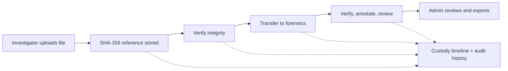

<div align="center">



**Portal for Recording and Managing Authentic Nodes**

Record evidence. Verify file integrity. Follow every handover.


[Quick start](#quick-demo) · [Features](#what-you-can-do) · [Setup](#persistent-setup) · [API](#api-overview) · [Demo walkthrough](#classroom-demonstration)

</div>

## Overview

P.R.A.M.A.N is a full-stack digital evidence management and chain-of-custody application built for a college BWP project. Investigators upload evidence, forensic officers examine assigned records, and administrators manage access and review activity.

Each upload receives a SHA-256 fingerprint. Later checks compare the stored file with that original reference, while a custody timeline records uploads, handovers, verification, notes, and status changes.

> [!NOTE]
> This is an educational prototype demonstrating digital evidence integrity. It is not a legally certified or tamper-proof evidence repository.

## Preview



_Actual application screenshot using synthetic classroom evidence._

## What you can do

- **Manage access** — JWT login, bcrypt passwords, three backend-enforced roles, and account deactivation.
- **Record evidence** — upload PDF, JPG, PNG, TXT, or DOCX files up to 10 MB with case metadata and automatic evidence IDs.
- **Check integrity** — stream SHA-256 calculations, compare original/current hashes, and detect changed or missing files.
- **Track custody** — transfer evidence to authorized users and review an append-only history of application events.
- **Review cases** — add investigation/forensic notes and update assigned evidence status.
- **Find records** — search by title, case number, description, or evidence ID, with filters and pagination.
- **Monitor activity** — view scoped dashboard statistics, recent records, and audit logs.
- **Export history** — download escaped XML for audit logs and individual custody timelines.

## Technology

- **Frontend:** HTML5 · CSS3 · vanilla JavaScript · Fetch API · responsive layouts
- **Backend:** Node.js · Express 5 · Mongoose · MongoDB replica-set transactions
- **Authentication:** JWT · bcrypt · backend role and assignment checks
- **Evidence:** Multer · Node crypto · SHA-256 · xmlbuilder2
- **Testing:** Node test runner · Supertest · real temporary MongoDB replica set

Express serves the frontend and API together. No Java or React is required.



## Quick demo

Requires Node.js 20.19+ (Node 24 recommended) and npm:

```sh
git clone https://github.com/Khatri-369/P.R.A.M.A.N.git
cd P.R.A.M.A.N
npm install
npm run demo
```

Open **[localhost:5000](http://localhost:5000)**. Demo mode starts a real, temporary MongoDB replica set and seeds three users; no separate MongoDB installation or `.env` is needed. The first launch needs internet access to download MongoDB.

> [!IMPORTANT]
> Demo database and uploads are temporary and reset when the demo is restarted. Use [persistent setup](#persistent-setup) to retain evidence.

Development/demo credentials only:

- Admin: `admin@praman.com` / `Admin@123`
- Investigator: `investigator@praman.com` / `Investigator@123`
- Forensic Officer: `forensic@praman.com` / `Forensic@123`

Passwords are bcrypt-hashed in MongoDB. Do not use these credentials on a public deployment.

## Persistent setup

1. Run `npm install`.
2. Copy `.env.example` to `.env` (PowerShell: `Copy-Item .env.example .env`).
3. Set `MONGO_URI` to a MongoDB Atlas database or a local MongoDB **replica set**. Transactions require a replica set; standalone MongoDB is not supported.
4. Set `JWT_SECRET` to a random secret of at least 32 characters. Generate one with `node -e "console.log(require('crypto').randomBytes(48).toString('hex'))"`.
5. Run `npm run seed` to create demo accounts. Re-running seed preserves existing accounts and passwords.
6. Run `npm run dev` for automatic backend restart, or `npm start`.
7. Open http://localhost:5000. Open the frontend through Express, not as local HTML files.

For a local MongoDB installation, start an isolated instance (do not reuse an existing instance's data folder):

```sh
mkdir mongo-data
mongod --dbpath ./mongo-data --replSet rs0 --bind_ip 127.0.0.1 --port 27017
```

In a second terminal, initialize it once:

```sh
mongosh --eval "rs.initiate()"
```

Wait for the replica set to elect its primary, then use `mongodb://127.0.0.1:27017/praman?replicaSet=rs0`. If another MongoDB service already occupies port 27017, choose a separate port and update both the shell connection and URI. MongoDB Atlas already provides replica-set support; configure its database user and network access for your machine.

Environment variables:

- `PORT`: HTTP port, default 5000.
- `MONGO_URI`: database URI; required for persistent mode.
- `JWT_SECRET`: required secret, minimum 32 characters.
- `CORS_ORIGIN`: allowed frontend origin; default `http://localhost:5000`.
- `UPLOAD_DIR`: optional absolute path for private evidence storage; default `backend/uploads`.

Back up the persistent MongoDB database **and** upload directory together. `.env`, uploaded files and dependencies are excluded from Git.

## Project structure

```text
backend/
  app.js, server.js       Express application and persistent startup
  demo.js, seed.js        Temporary demo startup and idempotent user seeding
  config/                MongoDB connection
  models/                User, Evidence, CustodyLog, AuditLog
  controllers/           Authentication, evidence, custody, audit, users, dashboard
  routes/                API routing and permissions
  middleware/            JWT, roles, uploads, centralized errors
  utils/                 Streaming hash, sequential ID, validation, transactions
  uploads/               Private evidence files (never served statically)
frontend/
  index.html             Login
  dashboard.html         Statistics and recent activity
  evidence.html          Search, filters and pagination
  evidence-details.html  Metadata, hashes, verification, notes, transfer, status
  upload.html            Evidence upload
  custody.html           Evidence lookup and custody timeline
  audit.html             Filterable audit history and XML export
  users.html             Account creation and activation management
  css/, js/              Responsive styles and modular Fetch-based page logic
tests/integration.test.js
samples/sample-evidence.txt
```

## Features and permission decisions

- All roles sign in and see dashboard statistics, evidence details and custody history within their permitted scope.
- **Admin** sees all records, manages users, reviews audit logs, exports audit/custody XML, and reassigns evidence when needed. Admin views verification results; the investigator/forensic roles perform verification.
- **Investigator** sees all evidence, uploads, verifies, adds notes, and transfers records they currently hold.
- **Forensic Officer** sees only evidence currently assigned to them, verifies it, adds notes, and changes its workflow status. This restriction applies to detail, download, custody, list and dashboard APIs.
- Transfers accept active investigators and forensic officers. Transferring to the existing holder is rejected. Forensic officers hand evidence back through admin reassignment.
- Users are deactivated, never deleted. A holder's evidence must be reassigned before deactivation. Admins cannot deactivate themselves. Every authenticated request reloads the user, so deactivation immediately blocks existing tokens.
- Search matches title, human-readable evidence ID, case number and description. Status/type/exact-case filters and paginated results use Fetch without page reloads.
- Workflow status and integrity status are separate. A `Verified` workflow status requires a successful integrity check; the latest integrity badge is the authoritative result.

## API overview

All API responses use `{ success, message, data }` on success and `{ success: false, message }` on errors. Downloads return the file or XML. Send `Authorization: Bearer <token>` on protected routes. `:id` and `:evidenceId` path parameters refer to MongoDB ObjectIds; human-readable IDs are returned as `evidenceId` and searchable in the UI.

Authentication:

- `POST /api/auth/login`: `{ email, password }`; returns JWT and user summary.
- `GET /api/auth/me`: current active account.
- `POST /api/auth/logout`: records logout; the browser then clears its session token.

Evidence:

- `GET /api/evidence?search=&status=&type=&caseNumber=&page=1&limit=10`
- `POST /api/evidence`: investigator only; multipart fields `title`, `caseNumber`, `description`, `evidenceType`, `notes`, and `file`.
- `GET /api/evidence/:id`: metadata and notes; records evidence view.
- `GET /api/evidence/:id/download`: authorized attachment download.
- `POST /api/evidence/:id/verify`: investigator/assigned forensic; returns `originalHash`, `currentHash`, `status`, `verificationDate`, `missing`.
- `POST /api/evidence/:id/notes`: `{ text }`.
- `PATCH /api/evidence/:id/status`: assigned forensic; `{ status }`.

Custody:

- `GET /api/custody/:evidenceId`
- `POST /api/custody/transfer`: `{ evidenceId, toUserId, remarks }`; current investigator holder or admin.
- `GET /api/custody/:evidenceId/export/xml`: admin.

Administration:

- `GET /api/dashboard/stats`: scoped statistics, recent evidence/activity, type counts.
- `GET /api/users/recipients`: active transfer recipients; admin/investigator.
- `GET /api/users`, `POST /api/users`: admin; creation body `{ name, email, password, role }`.
- `PATCH /api/users/:id/status`: admin; `{ isActive: false }` or `true`.
- `GET /api/audit`: admin; pagination plus `action`, user ObjectId, human-readable `evidenceId`, `startDate`, `endDate` filters.
- `GET /api/audit/export/xml`: admin; same filters, exports all matching events. Date filters use inclusive UTC calendar days.

## Classroom demonstration

1. Start the application and sign in as admin.
2. Open Users; create an investigator with a unique email and an 8+ character password.
3. Log out; sign in as that investigator.
4. Upload `samples/sample-evidence.txt` (Text), or a genuine PDF (Document). Enter a case number and title.
5. Open its details. Explain the generated `EV-YYYY-0001` identifier and original SHA-256. IDs increment safely; failed requests can leave harmless gaps.
6. Click Verify integrity. Confirm `VERIFIED` and matching original/current hashes.
7. Transfer to Demo Forensic Officer with a reason. Open View custody to see the handover.
8. Sign in as forensic. Confirm only assigned evidence is shown. Verify again, add a forensic note, and change status to Under Review or Verified.
9. Sign in as admin. Open Audit Logs and filter by evidence ID; export XML. Open custody and export that timeline as XML too.
10. To demonstrate failure safely, use a **disposable persistent test instance**, modify a stored file inside `backend/uploads`, then verify again. The original hash stays unchanged and integrity becomes Failed. A missing stored file also produces Failed with an explicit missing-file message. Automated tests perform both scenarios in isolated temporary storage.

## Verification

```sh
npm test
```

Tests use real temporary MongoDB and temporary uploads; they do not touch your configured database. The first run may download MongoDB.

The suite contains **14 passing tests** in the verified build, covering:

- The complete admin → investigator → forensic → audit demonstration.
- Invalid tokens/IDs, role restrictions, forensic assignment scope, and inactive accounts.
- Duplicate users, hashed passwords, and idempotent seeding.
- Upload content checks, size limits, rejected-file cleanup, and private file routes.
- Matching, altered, and missing files without overwriting the original hash.
- Transfer ownership, notes/status changes, and custody history.
- Dashboard statistics, audit filters, XML escaping, and export permissions.
- Competing transfers: only one handover commits for the current investigator.
- Transaction rollback: failed history writes leave no partial evidence changes.
- Frontend pages and referenced asset routes.

Browser checks also exercised upload, verification, transfer, forensic notes/status, and desktop/mobile layouts. XML response generation is covered by automated tests; file saving in the Codex in-app browser was not independently confirmed.

## Security and practical limits

- bcrypt hashes passwords; JWTs expire after eight hours. Tokens live in sessionStorage, so closing the tab clears that browser session. Logout clears the browser token and logs the event; it does **not** revoke a copied JWT server-side. Production use should add server-side revocation and secure cookie sessions.
- Routes enforce roles and forensic assignment on the backend. User-provided strings are escaped before rendering. Helmet headers, login rate limiting, request length limits, CORS and generic authentication errors are enabled.
- Uploads are limited to 10 MB and checked by extension, declared MIME type and basic file signatures. Files use random stored names and are available only through authenticated attachment downloads. These checks are **not antivirus or full format validation**; DOCX uses a basic ZIP/content-type marker check, and TXT rejects empty/NUL-containing files.
- Hashing streams file contents. The original reference hash is immutable in the application model and never overwritten by verification. Missing files are reported explicitly.
- Evidence mutations and audit/custody events commit in one MongoDB transaction. Filesystem writes are outside MongoDB transactions; rejected uploads are removed, but abrupt process termination can leave orphan files. Custody/audit history has no edit/delete routes.
- Database/filesystem administrators can still alter underlying data. SHA-256 equality shows agreement with a stored reference, not legal provenance or independent authenticity. This is not legally certified, enterprise-grade, or tamper-proof.
- XML exports and notes are intended for college-scale datasets. There is no antivirus, encrypted object storage, signed log anchoring, MFA, password-reset flow, or automatic backup system.

Future improvements: expiring invitations/password reset, server-revocable sessions, streamed large exports, malware scanning, encrypted object storage, restore-tested backups, and independently signed custody records.

## Troubleshooting

- Transaction errors usually mean the MongoDB URI points to a standalone instance. Use the replica set setup, Atlas, or `npm run demo`.
- `EADDRINUSE`: another process uses port 5000. Stop that process or set `PORT`; update `CORS_ORIGIN` to the same origin.
- Startup rejects JWT secrets shorter than 32 characters.
- Demo download failure: check internet/proxy access, or use persistent MongoDB instead.
- A deactivation conflict means the user still holds evidence. Reassign it as admin first.

---

<div align="center">

**P.R.A.M.A.N** · A college BWP project by [Khatri-369](https://github.com/Khatri-369)

[Report an issue](https://github.com/Khatri-369/P.R.A.M.A.N/issues) · [Back to top](#overview)

</div>
